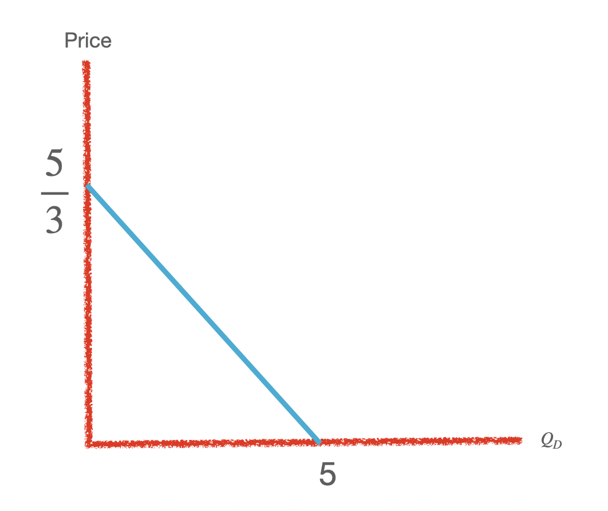

```
Numericals 
```

## Microeconomics  

---

### Basics 

#### Graphs & slope


**1. $Q_D=5-3X$ , What is the maximum $Q_d$ and price possible ?**

{width=30%}

- $max_{price}$

> when $Q_D=0$ or  the y intercept , substituting $Q_D=0$ in equation $Q_D+5-3X$

- $max_{quantity}$

> when p=0 , or x intercept which we can find by substituting p=0 in equation $Q_D+5-3X$


**2. If slope of budget line is $\frac{-5}{3} , p_x=2 , income=20$ , Draw the budget line.**


**3. Draw the budeget line when $p_x=3$ changes to $p_x'=6$ when $p_y=4,income=24$**

**4. Draw the supply curve by two industries a and b  $x_a=-4+3y$ and $x_b=4+3y$ and therir aggrate supply curve.**

#### market demand and supply


### Budget 

1. 

### preference & utilty functions 

#### cobb dogulas

1. $u=x^{0.2}y^{0.8}$ s.t. $3x+6y=36$ , find optimal solution.


2. $u=x^{0.5}y^{0.5}$ s.t. $3x+3y=36$ , find optimal solution. 


3. $u=x^{2}y^{3}$ s.t. $2y=36$ , find optimal solution. 


4. $u=x_1^2x_2^3x_3^4x_4^{0.2}x_5^{0.3}x_6^{0.5}$ s.t. $3x_1+2x_2+3x_3+5x_4+2x_5+x_6=360$ , find optimal solution. 

#### leontief

**1. 

#### linear

#### ces

#### quasi linear

#### lexicographic

#### bads

1. $u=-2x-3y$ s.t. $2x+3y=60$

2. $u=-2x+3y$ s.t. $3x+4y=6$

3. $u=-2x_1-3x_2+0.5x_3$ s.t. $x_1+x_2+96x_3=48$

#### others

**1. $u=min(x+y,x-y)$ s.t. $x+y=10$**

**2. $u=min(x+3y,2x-y)$ s.t. $x+y=10$**

**3. $u=max(x+2y)$ s.t. $x+3y=24$**

**4. $u=min(x+y)+max(x+y)$ s.t.$p_x+p_y=20$**


## Macroeconomics 

### competitive budgets 

### non- competitive budgets


